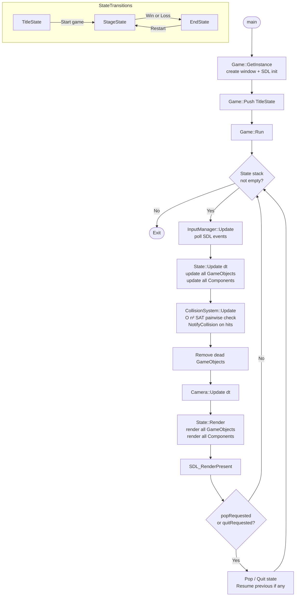

# Documentation

A 2D game engine built on top of SDL2, developed as part of the IDJ course at UnB. The engine follows a **Component-Entity-State** architecture and ships with a zombie-shooter demo game.

---

## Table of Contents

1. [Architecture Overview](#architecture-overview)
2. [Engine Loop Diagram](#engine-loop-diagram)
3. [Folder Structure](#folder-structure)
4. [Engine Core](#engine-core)
   - [Game](#game)
   - [State](#state)
   - [GameObject](#gameobject)
   - [Component](#component)
5. [Reusable Components](#reusable-components)
   - [Rendering](#rendering)
   - [Physics](#physics)
   - [Audio](#audio)
   - [Input](#input)
   - [Camera](#camera)
   - [Tiles](#tiles)
   - [Math Utilities](#math-utilities)
6. [Game Layer (Demo)](#game-layer-demo)
7. [Usage Examples](#usage-examples)
8. [Building](#building)

---

## Architecture Overview

The engine is split into two layers:

| Layer | Path | Purpose |
|---|---|---|
| **Engine** | `engine/` | Reusable systems: rendering, physics, input, audio, tiles, math |
| **Game** | `game/` | Demo game built on top of the engine |

The core design pattern is **Component-Entity-State (CES)**:

- A **State** owns a list of `GameObject`s and represents a screen (title, gameplay, end).
- A **GameObject** is a spatial entity that owns a list of `Component`s.
- A **Component** holds behavior and is the only place game logic lives.

---

## Engine Loop Diagram



---

## Folder Structure

```
SimpleGameEngine-IDJ-UnB/
├── engine/
│   ├── include/
│   │   ├── engine.h        # Umbrella include — use this in game code
│   │   ├── core/           # Game loop, State, GameObject, Component
│   │   ├── rendering/      # Sprite, SpriteRenderer, Animator, Text
│   │   ├── physics/        # Collider, CollisionSystem, SAT algorithm
│   │   ├── audio/          # Music, Sound, Resources asset cache
│   │   ├── input/          # InputManager (keyboard + mouse)
│   │   ├── camera/         # Camera viewport singleton
│   │   ├── tiles/          # TileSet + TileMap
│   │   ├── math/           # Vec2, Rect, Timer
│   │   └── utils/          # Log macros, cross-platform SDL includes
│   └── src/                # Implementation files (mirrors include/)
│
├── game/
│   ├── include/
│   │   ├── states/         # TitleState, StageState, EndState
│   │   ├── entities/       # Character, Gun, Bullet, Zombie
│   │   ├── controllers/    # PlayerController, AiController
│   │   └── systems/        # WaveSpawner, Wave, GameData
│   └── src/                # Implementation files (mirrors include/)
│
├── test/
│   ├── engine/             # Engine subsystem tests
│   └── game/               # Game logic tests
│
├── libs/                   # Bundled SDL2 libraries (Windows)
├── Makefile                # Default (Linux)
├── Makefile.macos
├── Makefile.win
└── Makefile.rules          # Shared rules
```

---

## Engine Core

### Game

The engine **singleton**. Initializes SDL2, SDL_image, SDL_mixer, and SDL_ttf. Owns the state stack and drives the main loop at ~30 FPS.

```cpp
// engine/include/core/Game.h
class Game {
public:
    static Game& GetInstance(string title, int w, int h);
    void Run();
    void Push(State* state);          // Schedule state push for next frame
    State& GetCurrentState();
    SDL_Renderer* GetRenderer();
    float GetDeltaTime();
    int GetWindowWidth() / GetWindowHeight();
};
```

**State stack semantics:**
- `Push(state)` — schedules the state; on the next frame it is pushed and `Start()` + `LoadAssets()` are called.
- When a state calls `RequestPop()`, it is removed and the previous state resumes.
- When a state calls `RequestQuit()`, the entire stack is cleared and the engine exits.

---

### State

Abstract base class for every screen in the game.

```cpp
// engine/include/core/State.h
class State {
public:
    virtual void LoadAssets() = 0;   // Load textures, audio, etc.
    virtual void Start()     = 0;    // Called after LoadAssets; spawn initial objects
    virtual void Update(float dt) = 0;
    virtual void Render()    = 0;

    void AddObject(GameObject* go);
    weak_ptr<GameObject> GetObjectPtr(GameObject* go);
    weak_ptr<GameObject> GetObjectByTag(const string& tag);
    vector<shared_ptr<GameObject>>& GetObjectArray();

    void RequestPop();
    void RequestQuit();
    bool PopRequested() / QuitRequested();

protected:
    void StartArray();
    void UpdateArray(float dt);
    void RenderArray();
    vector<shared_ptr<GameObject>> objectArray;
};
```

---

### GameObject

An **entity**: a spatial box, a rotation angle, a tag, and a list of components.

```cpp
// engine/include/core/GameObject.h
class GameObject {
public:
    Rect   box;        // World-space position and size
    double angleDeg;   // Rotation in degrees
    string tag;

    void AddComponent(Component* c);
    void RemoveComponent(Component* c);
    template<typename T> T* GetComponent();  // Returns first match or nullptr

    void Start();
    void Update(float dt);
    void Render();
    void NotifyCollision(GameObject& other);  // Forwarded to all components

    void RequestDelete();
    bool IsDead();
};
```

---

### Component

Abstract base. All game behavior is implemented as a `Component` subclass.

```cpp
// engine/include/core/Component.h
class Component {
public:
    Component(GameObject& associated);  // Back-reference to owning object

    virtual void Start() {}                           // Optional setup
    virtual void Update(float dt) = 0;
    virtual void Render()         = 0;
    virtual void NotifyCollision(GameObject& other) {} // Optional collision handler

protected:
    GameObject& associated;
};
```

---

## Reusable Components

### Rendering

#### SpriteRenderer

Attaches a sprite image to a GameObject. Automatically sizes the object's `box` to the sprite dimensions.

```cpp
// Component — engine/include/rendering/SpriteRenderer.h
auto* go = new GameObject();
auto* sr = new SpriteRenderer(*go);
sr->Open("assets/player.png");
sr->SetFrameCount(4, 1);   // spritesheet: 4 columns, 1 row
sr->SetFrame(0);
go->AddComponent(sr);
state.AddObject(go);
```

#### Animator

Plays named frame animations on a `SpriteRenderer`.

```cpp
// Component — engine/include/rendering/Animator.h
auto* anim = new Animator(*go);
anim->AddAnimation("walk", Animation(0, 3, 0.1f));  // frames 0-3, 0.1s/frame
anim->AddAnimation("die",  Animation(4, 7, 0.15f));
anim->SetAnimation("walk");
go->AddComponent(anim);
```

#### Text

Renders a TTF string at the object's position.

```cpp
// Component — engine/include/rendering/Text.h
auto* txt = new Text(*go, "fonts/OpenSans.ttf", 24, Text::BLENDED, "Score: 0", {255,255,255,255});
go->AddComponent(txt);
```

---

### Physics

#### Collider

Marks a GameObject as collidable. Maintains a box derived from `associated.box` with optional scale and offset.

```cpp
// Component — engine/include/physics/Collider.h
auto* col = new Collider(*go);
col->SetScale(Vec2(0.8f, 0.8f));   // shrink hitbox to 80%
col->SetOffset(Vec2(0, 4));        // shift hitbox down by 4 px
go->AddComponent(col);
```

#### CollisionSystem

Called once per frame inside a State to test all collidable pairs.

```cpp
// engine/include/physics/CollisionSystem.h — used in StageState::Update
collisionSystem.Update(GetObjectArray());
// → calls NotifyCollision(other) on both GameObjects for every overlapping pair
```

The algorithm uses the **Separating Axis Theorem (SAT)**, supporting rotated rectangles.

---

### Audio

```cpp
// Background music
Music bgm;
bgm.Open("audio/stage.ogg");
bgm.Play();          // loops indefinitely
bgm.Stop(1500);      // fade out over 1.5 s

// One-shot sound effects
Sound sfx;
sfx.Open("audio/shoot.wav");
sfx.Play();          // plays once
```

All assets are automatically cached by `Resources`; the same file is never loaded twice.

---

### Input

```cpp
// engine/include/input/InputManager.h — singleton
InputManager& input = InputManager::GetInstance();
input.Update();   // called once per frame by the engine

// Keyboard
if (input.IsKeyDown(RIGHT_ARROW_KEY))  { /* held */ }
if (input.KeyPress(SPACE_KEY))         { /* just pressed */ }
if (input.KeyRelease(ESCAPE_KEY))      { /* just released */ }

// Mouse
if (input.MousePress(LEFT_MOUSE_BUTTON)) {
    Vec2 worldPos{ input.GetMouseXWorld(), input.GetMouseYWorld() };
}
```

Defined key constants: `LEFT/RIGHT/UP/DOWN_ARROW_KEY`, `ESCAPE_KEY`, `SPACE_KEY`, `LEFT_MOUSE_BUTTON`.

---

### Camera

```cpp
// engine/include/camera/Camera.h — singleton
Camera& cam = Camera::GetInstance();

cam.Follow(playerGameObject);    // camera tracks object center
cam.Unfollow();                  // free camera; arrow keys move it
cam.SetSpeedMultiplier(0.5f);    // parallax scrolling factor

// In State::Update:
cam.Update(dt);
```

When a `Sprite` has `cameraFollower = true` (e.g., a HUD background), it is rendered at fixed screen position regardless of camera offset.

---

### Tiles

```cpp
// engine/include/tiles/TileMap.h — Component
auto* goMap = new GameObject();
auto* tileMap = new TileMap(*goMap, "maps/stage1.txt", new TileSet(64, 64, "tiles/tileset.png"));
goMap->AddComponent(tileMap);
state.AddObject(goMap);

// Tile map file format (space-separated integers, 0-indexed tile IDs, -1 = empty):
// mapWidth mapHeight mapDepth
// <row of tile IDs per layer>
```

`TileMap` supports multiple depth layers. Call `RenderLayer(z)` to render a specific layer.

---

### Math Utilities

```cpp
// Vec2
Vec2 a{3.0f, 4.0f};
float mag  = a.Magnitude();          // 5.0
Vec2  norm = a.Normalize();
Vec2  rot  = a.Rotate(M_PI / 4.0f);
float dist = a.Distance(Vec2{0,0});

// Rect
Rect r{10, 20, 100, 50};
Vec2 center = r.GetCenter();
r.SetCenter(Vec2{200, 200});
bool inside = r.IsVec2Inside(Vec2{150, 200});
Vec2 diff   = r.Distance(otherRect);  // center-to-center delta

// Timer
Timer t;
t.Update(dt);
if (t.Get() >= 2.0f) {
    t.Restart();
    // do something every 2 seconds
}
```

---

## Game Layer (Demo)

The demo is a top-down zombie shooter with three states:

```
TitleState → StageState → EndState
                 ↑____________↓  (restart)
```

### State flow

| State | Description |
|---|---|
| `TitleState` | Title screen; press any key to start |
| `StageState` | Spawns player + wave-based zombie enemies; tracks win/loss |
| `EndState` | Shows win or loss screen; allows restart |

### Key game components

| Component | Role |
|---|---|
| `Character` | Health, command queue (MOVE / SHOOT), hit flash, death |
| `PlayerController` | Reads arrow keys + mouse click → enqueues Character commands |
| `AiController` | Computes direction toward player → enqueues Character commands |
| `Gun` | Creates `Bullet` GameObjects when `Shoot(target)` is called |
| `Bullet` | Travels a fixed distance, auto-deletes; `targetsPlayer` flag |
| `Zombie` | Enemy that chases the player via `AiController` |
| `WaveSpawner` | Spawns waves of zombies and NPCs on cooldown timers |

### Win / loss condition (StageState::Update)

```cpp
// Loss: player is dead
if (player->GetComponent<Character>()->IsDead())  { GameData::playerVictory = false; Push(EndState); }

// Win: all wave enemies defeated
if (waveSpawner->GetComponent<WaveSpawner>()->AllWavesCompleted()) { GameData::playerVictory = true; Push(EndState); }
```

---

## Usage Examples

### Minimal custom State

```cpp
#include "engine.h"

class MyState : public State {
    Music bgm;
public:
    void LoadAssets() override {
        bgm.Open("audio/theme.ogg");
    }

    void Start() override {
        bgm.Play();

        auto* go = new GameObject();
        go->box  = Rect(100, 100, 64, 64);
        go->tag  = "hero";

        auto* sr = new SpriteRenderer(*go);
        sr->Open("img/hero.png");
        go->AddComponent(sr);

        AddObject(go);
        StartArray();
    }

    void Update(float dt) override {
        InputManager& in = InputManager::GetInstance();
        if (in.KeyPress(ESCAPE_KEY)) RequestPop();

        UpdateArray(dt);
        Camera::GetInstance().Update(dt);
    }

    void Render() override { RenderArray(); }
};
```

### Custom Component with collision response

```cpp
#include "engine.h"

class HealthPickup : public Component {
    int healAmount;
public:
    HealthPickup(GameObject& go, int amount)
        : Component(go), healAmount(amount) {}

    void Update(float dt) override {}
    void Render() override {}

    void NotifyCollision(GameObject& other) override {
        if (other.tag == "player") {
            other.GetComponent<Character>()->Heal(healAmount);
            associated.RequestDelete();
        }
    }
};
```

### Spritesheet animation

```cpp
auto* go   = new GameObject();
auto* sr   = new SpriteRenderer(*go);
sr->Open("img/character.png");
sr->SetFrameCount(8, 4);   // 8 cols × 4 rows

auto* anim = new Animator(*go);
// Frames 0–7 are the walk cycle (row 0)
anim->AddAnimation("walk", Animation(0, 7, 0.1f));
// Frames 8–11 are the attack cycle (row 1)
anim->AddAnimation("attack", Animation(8, 11, 0.08f));
anim->SetAnimation("walk");

go->AddComponent(sr);
go->AddComponent(anim);
state.AddObject(go);
```

### Following camera with parallax

```cpp
// Attach camera to player
Camera::GetInstance().Follow(playerGo);
Camera::GetInstance().SetSpeedMultiplier(1.0f);

// Background scrolls at half speed (parallax)
Camera::GetInstance().SetSpeedMultiplier(0.5f);
// ... render background layer, then reset to 1.0f for foreground
```

---

## Building

### macOS

```bash
make -f Makefile.macos
./dist_macos/JOGO
```

### Linux

```bash
make
```

### Windows (MinGW)

```bash
make -f Makefile.win
```

Dependencies: **SDL2**, **SDL2_image**, **SDL2_mixer**, **SDL2_ttf**. Windows libs are bundled under `libs/windows/SDL2/`.
